# 基于Springboot的租房管理系统

## Springboot-0096


## 技术栈

Springboot mybatisplus vue mysql maven


## 数据库表(16张)


## 功能介绍

```properties
本租房管理系统有管理员，租客，屋主三个角色。

管理员功能有个人中心，租客管理，屋主管理，房源信息管理，订单信息管理，屋主申诉管理，通知公告管理，留言板管理，系统管理等。

屋主发布房源信息，租客预约看房，生成订单。
```


## 图片

### 前台


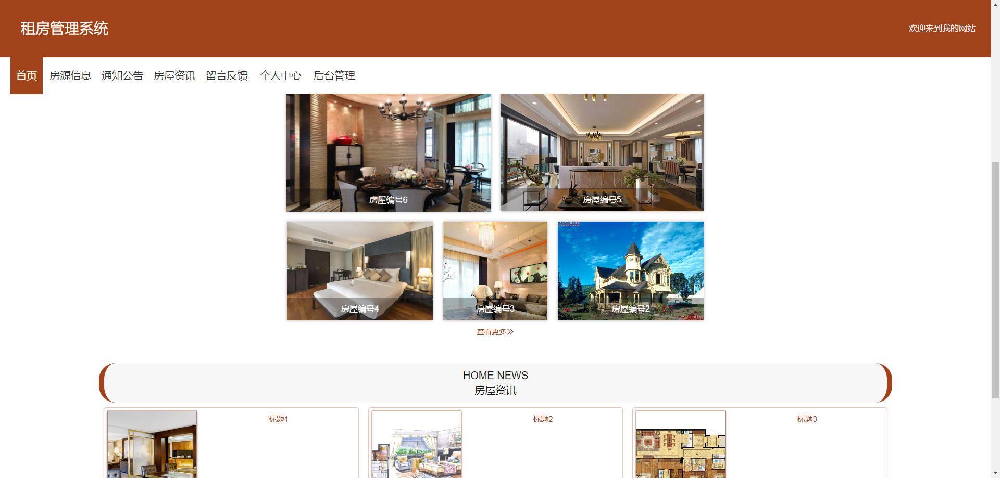


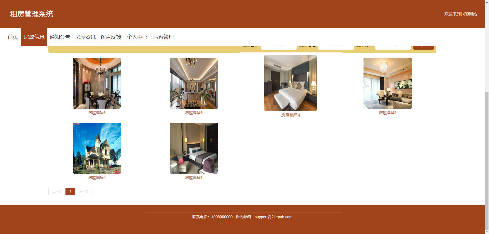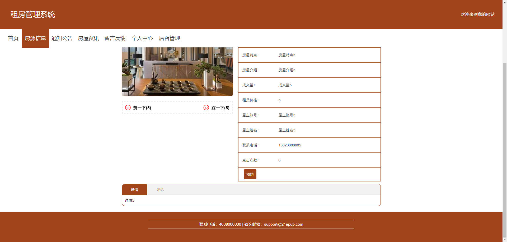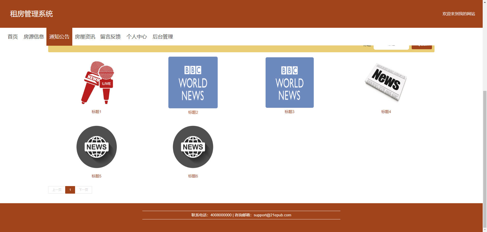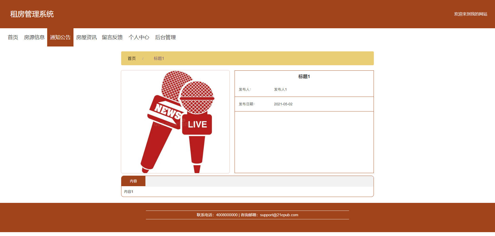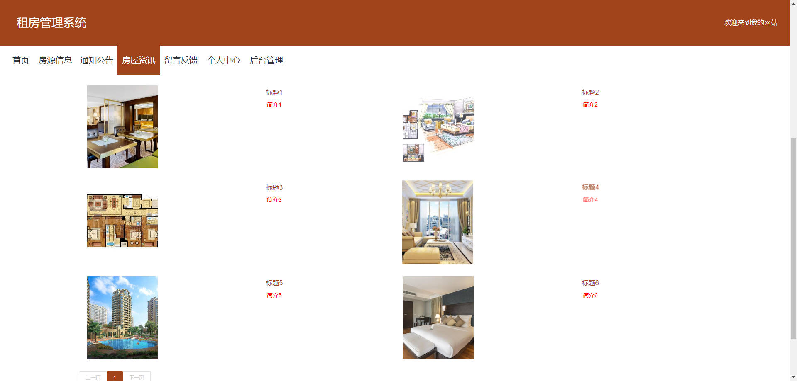

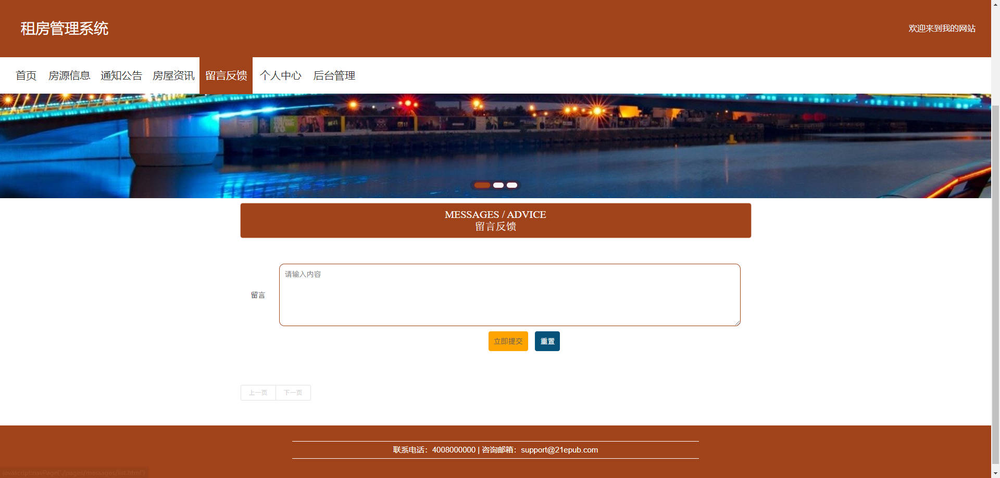

### 后台


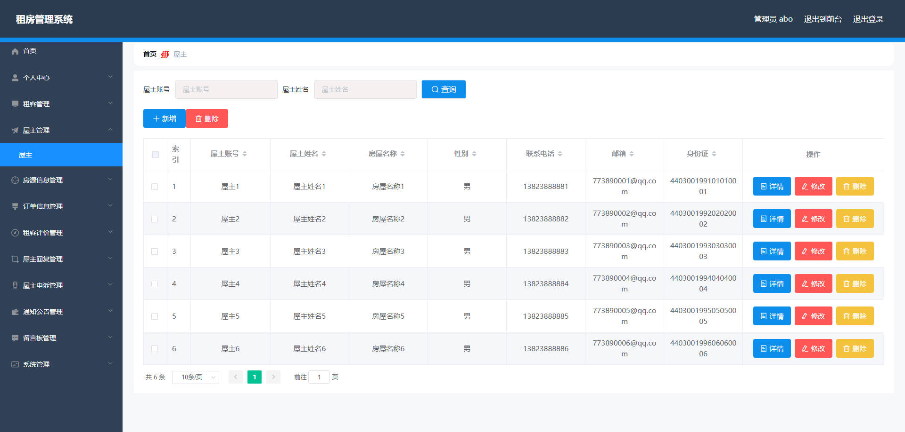

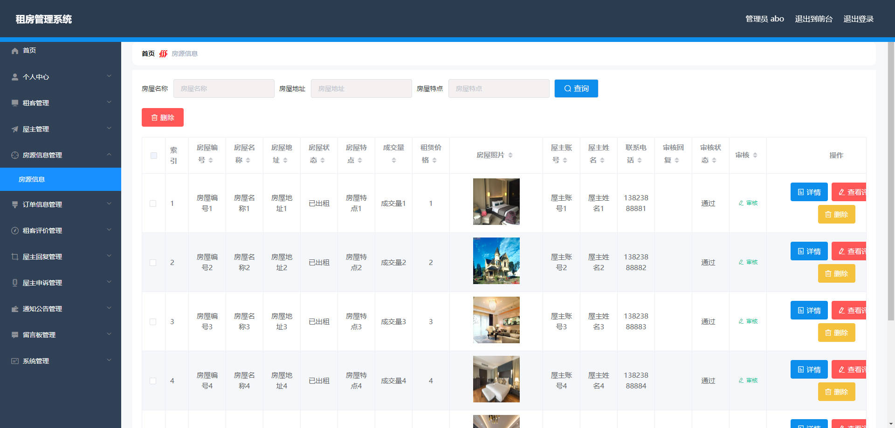

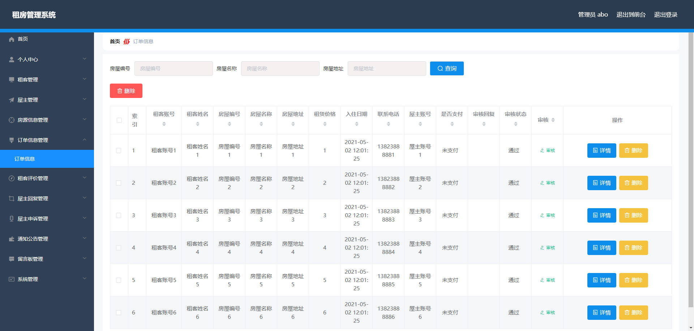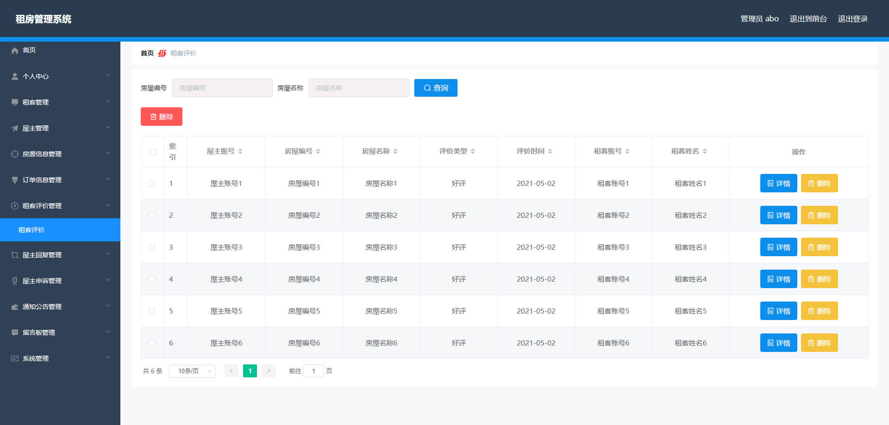

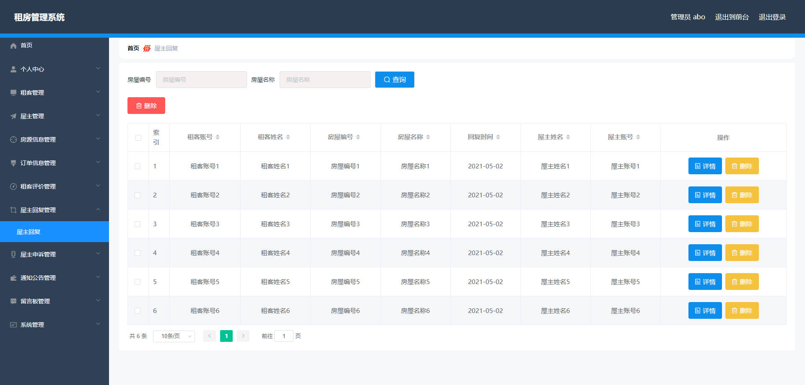

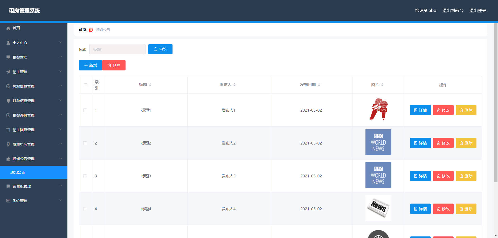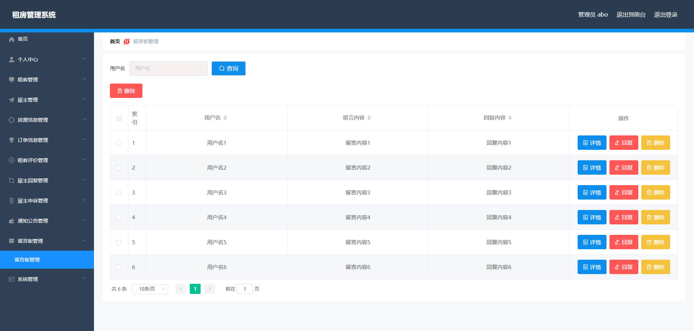


## 访问路径

### 前台

```properties
http://localhost:8080/springboot94sk3/front/pages/login/login.html

账号 租客1
密码 123456
```

### 后台

```properties
http://localhost:8080/springboot94sk3/admin/dist/index.html#/login

账号 abo
密码 abo
```


## 功能图

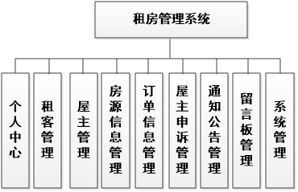


## 文档目录

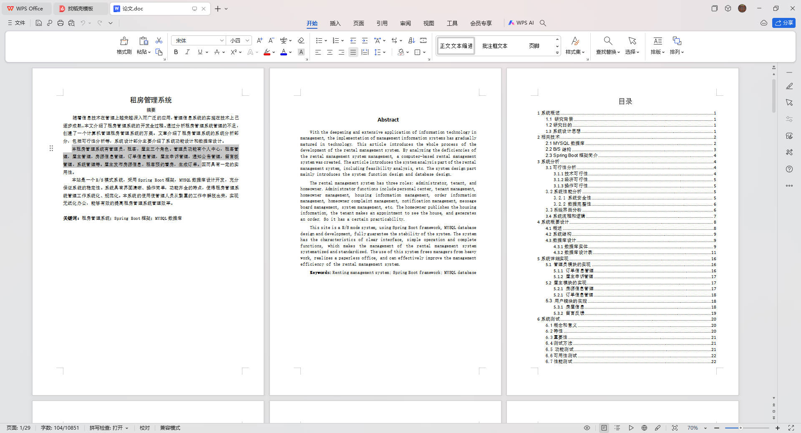


## 打赏或交流


